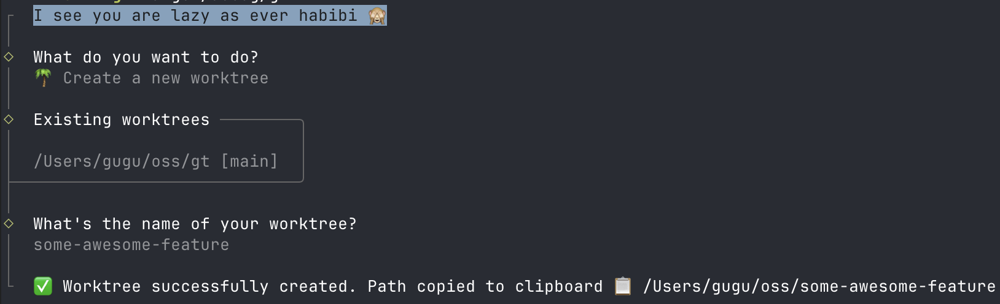
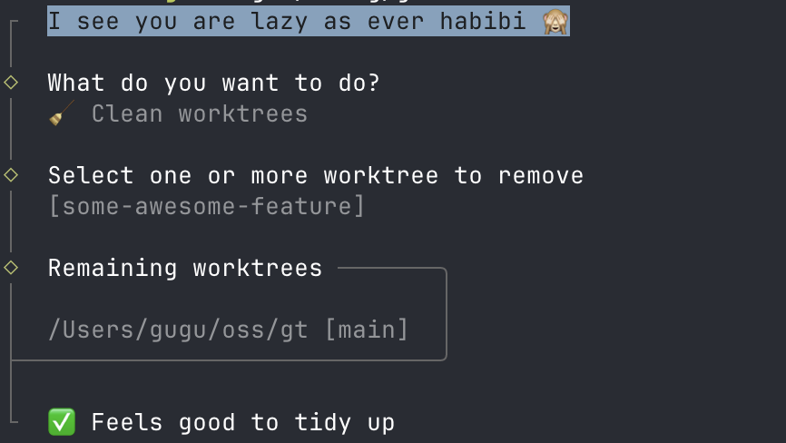

# gt

`gt` is a dead simple cli to help me manage git worktrees because I'm lazy.

It wraps `git worktree` behind a couple of friendly prompts: create a new worktree
(and get its path copied to your clipboard), or clean up the ones you're done with.





## Installation

### Homebrew

```sh
brew install fkhadra/tap/gt
```

### Shell installer

Grab the latest release from the [releases page](https://github.com/fkhadra/gt/releases)
and run the provided install script, or:

```sh
curl --proto '=https' --tlsv1.2 -LsSf https://github.com/fkhadra/gt/releases/latest/download/gt-installer.sh | sh
```

Prebuilt binaries are available for macOS (Apple Silicon & Intel), Linux (x86_64 & ARM64),
and Windows (x86_64).

### From source

Requires a recent Rust toolchain (edition 2024).

```sh
git clone https://github.com/fkhadra/gt.git
cd gt
cargo install --path .
```

## Usage

Run `gt` from anywhere inside a git repository:

```sh
gt
```

You'll be asked what you want to do:

### 🌴 Create a new worktree

Shows your existing worktrees, then prompts for a name. A bare name (e.g.
`some-awesome-feature`) creates the worktree in a sibling directory (`../some-awesome-feature`);
pass a path to place it wherever you like. Once created, the worktree's path is copied to
your clipboard so you can `cd` straight into it.

### 🧹 Clean worktrees

Lists every worktree and lets you multi-select the ones to remove. If a worktree has
uncommitted changes, `gt` asks for confirmation before force-removing it, so you don't
lose work by accident.
